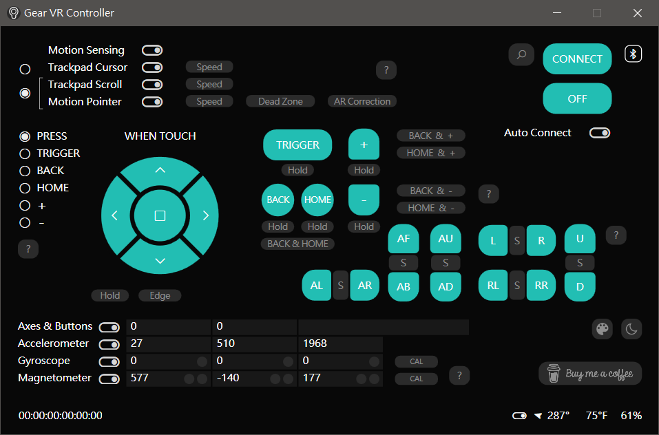

# Gear VR Controller Motion Pointer for Windows

Convert the Gear VR Controller into a PC air mouse, motion pointer, wireless presenter and gyro/motion gamepad. Light gun emulation is also possible.

Features
- No VR headset or mobile phone needed
- Wireless presenter, air mouse and motion pointer
- Key or action mapping to buttons and motions
- Combo editor for keys input
- Trackpad mouse cursor or scrolling
- Compass mode
- Quick and easy calibration of sensors

Setup Guide
- No pairing needed, just turn on PC Bluetooth and install batteries to the controller
- Press any button on the controller, then click the Search icon in app
- Click the Connect button, that's it

Calibration for Motion Sensing and Motion Pointer
- Place the controller upside down on a stable surface, then click the CAL button, that's it

Download latest version

v2.1.12
[Link 1](https://drive.google.com/drive/folders/1FN2FOPHm6QyQqntdEFUnvLKOWFaLj8HI)
[Link 2](https://www.mediafire.com/file/mr4r299a5cj822j/Gear_VR_Controller_setup.exe/file)
 
SHA-256: 7fd5ec9ea7648568f2091e6bbfb64e2a171f70257c24a600d72ef2e9dbb20d56

System requirements
- Windows 10 x64 or Windows 11
- .NET Desktop Runtime 9.0

 

Details
- [\*Secret\* gyro/motion gamepad emulation](#secret-gyromotion-gamepad-emulation-in-new-version)
- [< The House of the Dead 2: Remake > PC gyro aiming](#-the-house-of-the-dead-2-remake--pc-gyro-aiming-sample-config)
- [< The House of the Dead: Remake > PC gyro/lightgun aiming](#-the-house-of-the-dead-remake--pc-gyrolightgun-aiming-sample-config)
- [< Panzer Dragoon: Remake > PC gyro aiming](#-panzer-dragoon-remake--pc-gyro-aiming-sample-config)
- [< The Typing of the Dead: Overkill > PC lightgun aiming](#-the-typing-of-the-dead-overkill--pc-lightgun-aiming-sample-config)
- [< The House of the Dead III > PC lightgun aiming](#-the-house-of-the-dead-iii--pc-lightgun-aiming-sample-config)
- [< MAME > emulator PC lightgun aiming](#-mame--emulator-pc-lightgun-aiming-sample-config)
- [< Cxbx-Reloaded > emulator PC lightgun aiming](#-cxbx-reloaded--emulator-pc-lightgun-aiming-sample-config)
- [Backup of user config](#backup-of-user-config)
- [Hints on low input lag](#hints-on-low-input-lag-for-games-and-emulators)

 

Gear VR is a trademark or registered trademark of Samsung Electronics Co., Ltd.
 
​Windows is a trademark or registered trademark of Microsoft Corporation

 

## \*Secret\* gyro/motion gamepad emulation in new version

Now you can use the controller like a gyro gamepad. Gyro aiming together with analog touch stick (needn't press) are supported. Gamepad buttons and sticks are added to key assignment list for mapping to touchpad press (8 directions, center and lower edge), other 5 buttons and 12 motions.

To use the gamepad mode, install [ViGEmBus](https://github.com/nefarius/ViGEmBus/releases/tag/v1.22.0), edit the file "C:\Program Files\Gear VR Controller\Gear_VR_Controller.dll.config" (default, text editor needs to be run as admin) and restart the app.

Modify to False in the line under:

DefaultStabilizePointerClick

Modify to True in the lines under:

DefaultGameMode
 
DefaultGameKeyboardMode
 
DefaultGamePointerMode
 
DefaultEmulateGamepad

For easier control, assign "Toggle between cursor and pointer mode" to a button, or assign "Pointer temporary on" to the new second action of buttons by modifying the line under any of:

KeyTouchButtonCenter2 / KeyBackButton2 / KeyHomeButton2 / KeyVolumeUpButton2 / KeyVolumeDownButton2 / KeyTouchButton2 / KeyTriggerButton2 / KeyTouchDirectCenter2

You can also map controller roll, pitch, yaw motions to stick axes or triggers to make it a motion gamepad. Try to adjust motion pointer speed to 1~3 and assign a pointer reset button. Explore more settings if you're interested.

Modify to True in the lines under:

DefaultGamepadUsePitch
 
DefaultGamepadUseYaw

Some games may work better with keyboard+mouse emulation, or if you want to combine its input with another gamepad, in that case, leave the DefaultEmulateGamepad option to False.

If the game is run as admin, this app also needs to be run as admin, otherwise Windows won't let them work together.

 

## < The House of the Dead 2: Remake > PC gyro aiming sample config

Config file
[Link](https://www.mediafire.com/file/ca3mrdhr4q8jl0g/Gear_VR_Controller.dll.config_the.house.of.the.dead.2.remake.zip/file)

ViGEmBus not required, update the app to v2.1.12, extract the config to "C:\Program Files\Gear VR Controller\" (default), then assign keys for example:

Trigger: Mouse left button, Back: Enter, Home: Tab, +: F, -: Esc

Touchpad - Center: Mouse right button, West: Q, East: E, South: Pointer temporary off, North: Unassigned

Touchpad (without press) is mapped to WASD by default, you can change it by modifying KeyTouchDirectNorth/East/South/West/Center in the config file (and restarting app, text editor needs to be run as admin) when necessary.

Adjust the motion pointer speed to around 4 in app and switch to motion pointer mode before starting the game, then in game options, set controller to Keyboard/Mouse, aiming stick to Both Sticks, mouse sensitivity to 1.0, crosshair speed to 1.0.

If the game is run as admin, this app also needs to be run as admin, otherwise Windows won't let them work together.

This config file is also suitable for < Panzer Dragoon: Remake >, just change the key assignments to match the game. But the game has forced mouse smoothing, you need to move the controller slowly.

 

## < The House of the Dead: Remake > PC gyro/lightgun aiming sample config

Config file for gyro aiming
[Link](https://www.mediafire.com/file/yxi0v4sfd9ypkyy/Gear_VR_Controller.dll.config_the.house.of.the.dead.remake.zip/file)

ViGEmBus not required, update the app to v2.1.12, extract the config to "C:\Program Files\Gear VR Controller\" (default), then adjust the motion pointer speed to around 4 in app and assign keys for example:

Trigger: Mouse left button, Back: Enter, -: Esc

Touchpad - Center: Mouse right button, West: Q, East: E, North: F, South: Pointer temporary off

If you have installed a lightgun or arcade plugin (like [this](https://steamcommunity.com/app/1694600/discussions/0/3271312219438716734/) or [this](https://github.com/argonlefou/HotdRemake_ArcadePlugin/)), you can emulate lightgun aiming by using another [config file](https://www.mediafire.com/file/nr93jqt7o9zzsg4/Gear_VR_Controller.dll.config_lightgun.zip/file). Assign Pointer reset to Touchpad South, also other keys according to the plugin, then adjust the motion pointer speed to around 8~12 in app.

Switch to motion pointer mode before starting the game, then in game options, set controller type to Keyboard/Mouse, sensitivity to 1.0, crosshair speed to 1.00.

If the game is run as admin, this app also needs to be run as admin, otherwise Windows won't let them work together.

The lightgun aiming config is also suitable for < The Typing of The Dead: Overkill > and < The House of the Dead III >, just change the key assignments to match the game.

 

## < Panzer Dragoon: Remake > PC gyro aiming sample config

Use the same config file as < The House of the Dead 2: Remake >, and change the key assignments to match the game. But the game has forced mouse smoothing, you need to move the controller slowly.

 

## < The Typing of the Dead: Overkill > PC lightgun aiming sample config

Follow the instructions of lightgun aiming config in < The House of the Dead: Remake >, and change the key assignments to match the game.

 

## < The House of the Dead III > PC lightgun aiming sample config

Follow the instructions of lightgun aiming config in < The House of the Dead: Remake >, and change the key assignments to match the game.

 

## < MAME > emulator PC lightgun aiming sample config

Config file for lightgun emulation in games like Time Crisis and Virtua Cop
[Link](https://www.mediafire.com/file/nr93jqt7o9zzsg4/Gear_VR_Controller.dll.config_lightgun.zip/file)

ViGEmBus not required, update the app to v2.1.12, extract the config to "C:\Program Files\Gear VR Controller\" (default), assign keys for example:

Trigger: Mouse left button, Back: 1, Home: 5, Touchpad Center: Mouse right button, Touchpad South: Pointer reset

If you want to use non-press Touchpad for pedal, modify KeyTouchDirectCenter in the config file from Unassigned to Mouse right button (and restart app, text editor needs to be run as admin).

In MAME game's input device options, set lightgun and pedal device assignments to lightgun, keyboard input provider to dinput, lightgun input provider to win32. Adjust the motion pointer speed to around 8~12 in app and switch to motion pointer mode before starting game.

Other emulators may use the same config file with similar settings. If the emulator or game is run as admin, this app also needs to be run as admin, otherwise Windows won't let them work together.

 

## < Cxbx-Reloaded > emulator PC lightgun aiming sample config

For games like Virtua Cop 3, use the same config file as < MAME >, and assign keys for example:

Trigger: Mouse left button, Home: Enter

Touchpad - Center: Mouse right button, West: Mouse middle button, North: Mouse X1 button, South: Pointer reset

In Cxbx-Reloaded input settings, select MS Gamepad S, set Device to DInput/0/KyeboardMouse, load Default Bindings, then set L Stick Up/Down/Left/Right to Cursor Y+/Y-/X-/X+ (by Shift+Right-click after setting to Axis mode), set Buttons A, B, X, Trigger Left to Click 0, Click 1, Click 2, Click 3 respectively.

Adjust the motion pointer speed to around 8~12 in app and switch to motion pointer mode before starting game.

 

## Backup of user config

You can backup the user config file for different settings or game profiles. It's inside a sub-sub folder in %LOCALAPPDATA%\Gear_VR_Controller

 

## Hints on low input lag for games and emulators

- Turn on game mode of TV or monitor if available
- Turn on low latency mode or anti-lag of GPU driver
- Keep the controller within good coverage of Bluetooth

